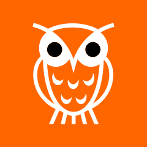

# [Comments Owl for Hacker News](https://soitis.dev/comments-owl-for-hacker-news)

**Comments Owl for Hacker News is a browser extension which makes it easer to follow comment threads on [Hacker News ](https://news.ycombinator.com) across multiple visits, adds the ability to annotate and mute other users, plus other UI and UX tweaks**

> [!IMPORTANT]
> This is the support repository for Comments Owl for Hacker News - for installation links, information about the extension, screenshots, and FAQs, please visit the [Comments Owl for Hacker News website](https://soitis.dev/comments-owl-for-hacker-news).

Follow [@soitis.dev](https://bsky.app/profile/soitis.dev) on Bluesky for extension updates and other announcements.

Check the availability of the latest updates for your browser on the [releases page](https://github.com/insin/comments-owl-for-hacker-news/releases).

## Support

To report a bug, [create a new Issue](https://github.com/insin/comments-owl-for-hacker-news/issues/new).

Please include:

- The version of the extension you're using
- The browser and operating system you're using it on
- Relevant URLs if applicable
- Relevant screenshots if applicable

If you don't have a GitHub account, post bug details or feature requests to [@soitis.dev](https://bsky.app/profile/soitis.dev) on Bluesky.

If you don't have a Bluesky account, or want to provide more information than a post allows, send an email to [extensions@soitis.dev](mailto:extensions@soitis.dev).

## Icon Attribution

Icon adapted from "Owl icon" by [Lorc](https://lorcblog.blogspot.com/) from [game-icons.net](https://game-icons.net), [CC 3.0 BY](https://creativecommons.org/licenses/by/3.0/)
