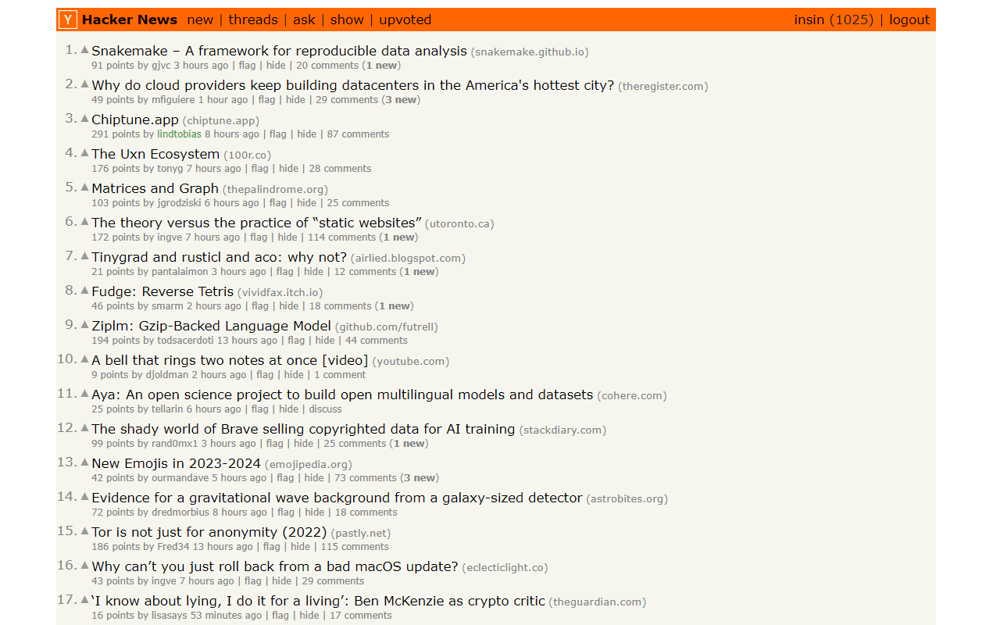
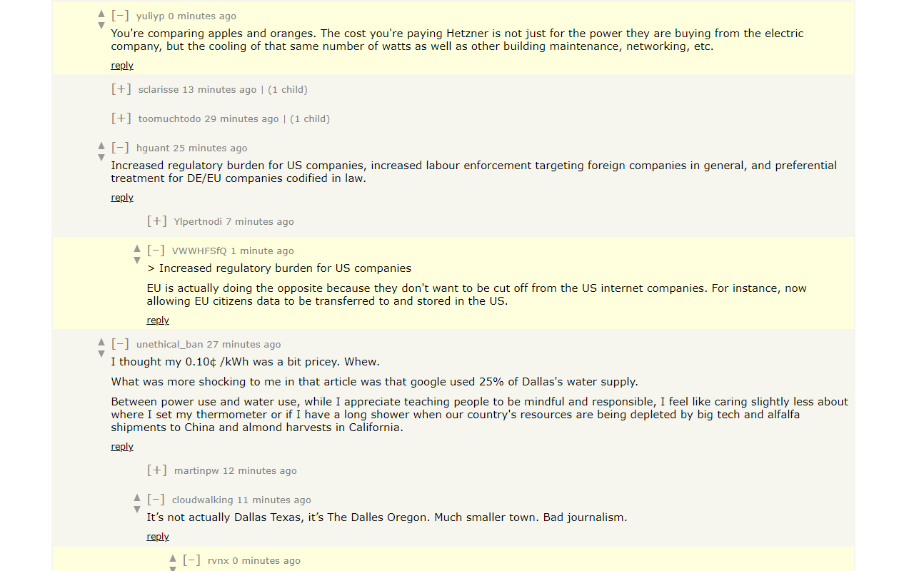
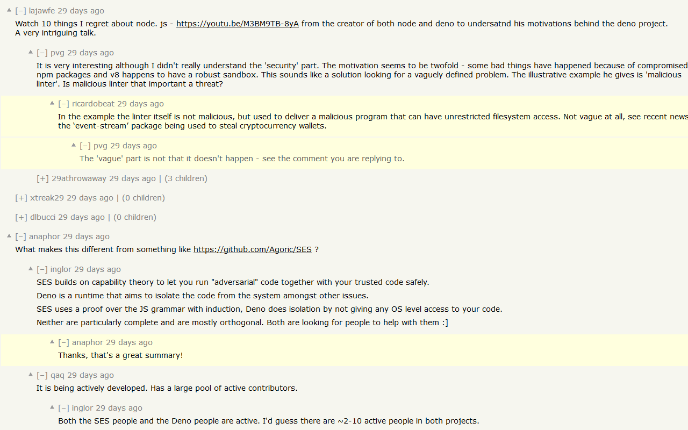
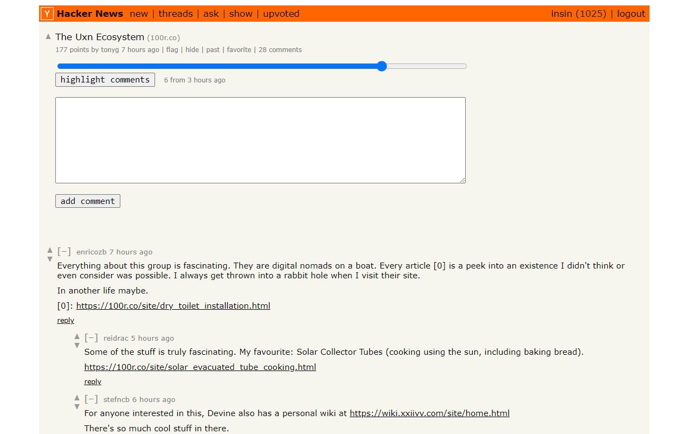
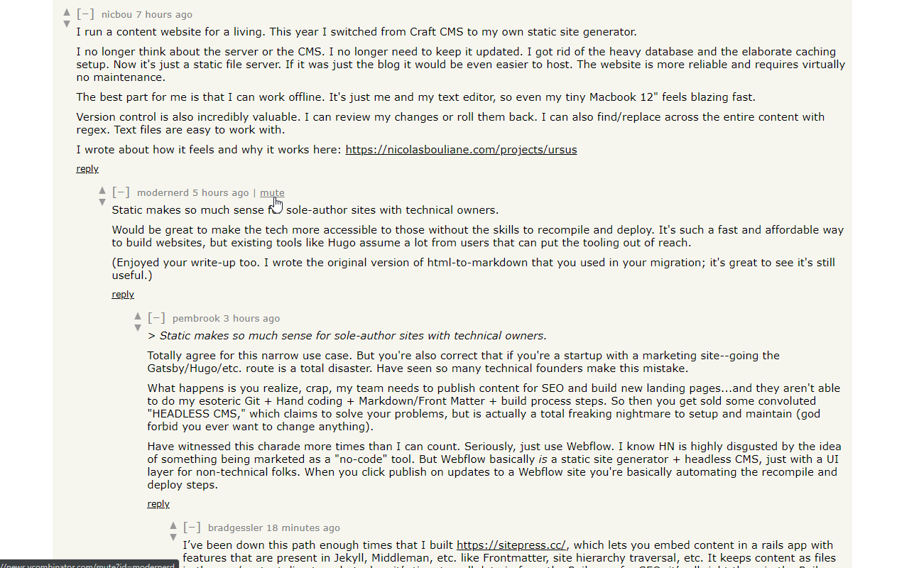
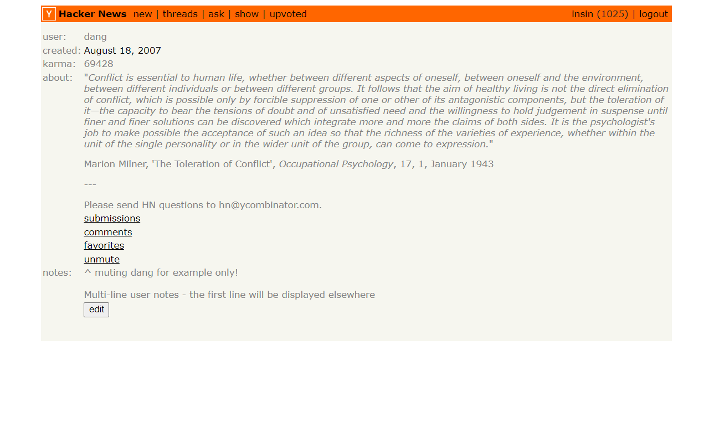
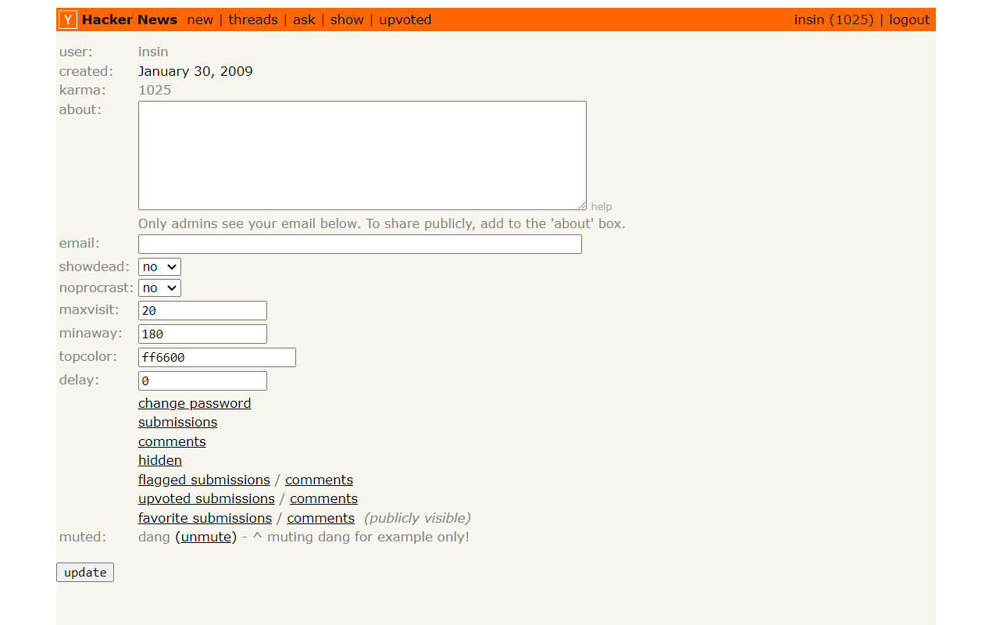

# Comments Owl for Hacker News

A browser extension which draws the rest of the friendly owl for Hacker News comment threads to make them actually followable over time, by automatically highlighting new comments, showing which items have new comments, muting and adding notes to users, as well as various other UX tweaks for Hacker News.

* [Install Chrome Extension](https://chrome.google.com/webstore/detail/hn-comments-owl/kpoggabejgbenjahggloahnnaolmfock)
* [Install Firefox Add-on](https://addons.mozilla.org/en-US/firefox/addon/hn-comments-owl/)
* [Install as a user script](https://greasyfork.org/en/scripts/18066-hn-comment-trees) (requires a [user script manager](https://greasyfork.org/en#home-step-1))

## Features

### List pages

- Show new comment counts since you last viewed each item - clicking on the "X new" link will  highlight new comments and collapse comment trees which don't contain any new comments
- Prevent accidental flagging on mobile by hiding the flag control or requiring confirmation

### Comment pages

- Highlight new comments and collapse comment trees which don't contain any new comments when you revisit an item's comments - you can configure whether or not this happens automatically when you revisit
- Default comment folding controls are replaced with a Reddit-style left-aligned control, with a slightly larger hit target
- Manually highlight the X most-recent comments
- Mute users to hide their comments and replies to them - muted users can be managed on your own profile page
  - Logged out users get a new 'muted' link in the header they can use to manage their muted users
- Add your own notes to other users on their profile page - the first line will be displayed next to their comments
- Toggle display of "reply" links below comments to make more room for comments on the screen
- Increased distance between the upvote and downvote arrows on mobile

### Navigation

- Hide navigation items you don't use
- Add an "upvoted" link to the header to make it easier to get back to previously visited items
- Improves mobile navigation by display links below other header contents

## Screenshots

### Item list page with new comment counts

### Automatic new comment highlighting & collapsing

### Mid-thread view of new comment highlighting & collapsing

### Manual highlighting of recent comments

### User muting

| Mute users by hovering over a comment | Mute/unmute users via their profile page | Manage muted users on your own profile page |
|:-------:|:------:|:------:|
|  |  |  |

## Icon Attribution

Icon adapted from "Owl icon" by [Lorc](https://lorcblog.blogspot.com/) from [game-icons.net](https://game-icons.net), [CC 3.0 BY](https://creativecommons.org/licenses/by/3.0/)
